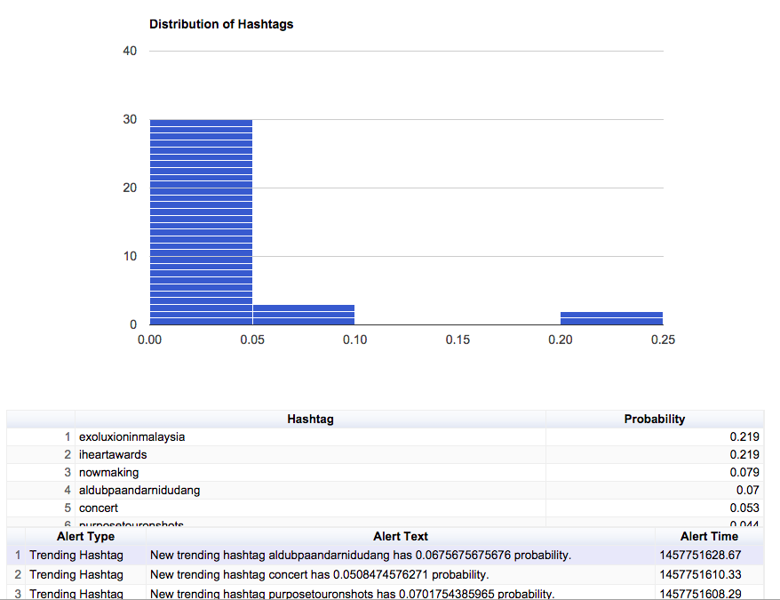

# Entropy Exercise
## System Overview
## Description of System

My system reports changes in hashtags in conversation in Tweets with people mentioning concerts.  This could be useful
in identify both live concert events and locations as well as concert ticket announcements.

The system creates two types of alerts: alerts for new hashtags in the top 5 and alerts when the entropy of the system
reaches new maximum within the retention window.

The alerts, probability and a histogram of hashtag freqency are all displayed on a primary dashboard as illustrated below.

## Dashboard
Below is an image showing the probability distribution, alerts and the top items in the probability distribution.

## Data Flow

- Data comes in in the form of Tweets through stream_connect.py, this outputs tweets with an added timestamp to the 
stdout.  Only messages with hashtags are passed downstream.  Hashtags are explicitly identified by twitter in the 
entities section of the JSON

- Twitter messages are processed into 2 types of messages by entities.py: delta messages contain time between messages 
for rate calculations and hashtag messages contain hashtags and times for probability discribution calculation.

- Both types of messages are read and stored to different redis databases for access by the API by store_redis.py

- event_poller.py has 2 functions:
    *Storing entropy and probability distributions to redis every 2 seconds
    *Checking for entropy and probability change events

## Usage: Starting the System
###run to start redis
redis-server

### run this to insert data into redis
python stream_connect.py | python entities.py | python store_redis.py

###run this to start api server

python concert_api.py

### run this to start event detection poller

python event_poller.py

###go here to see current dashboard

http://127.0.0.1:5000/ 
